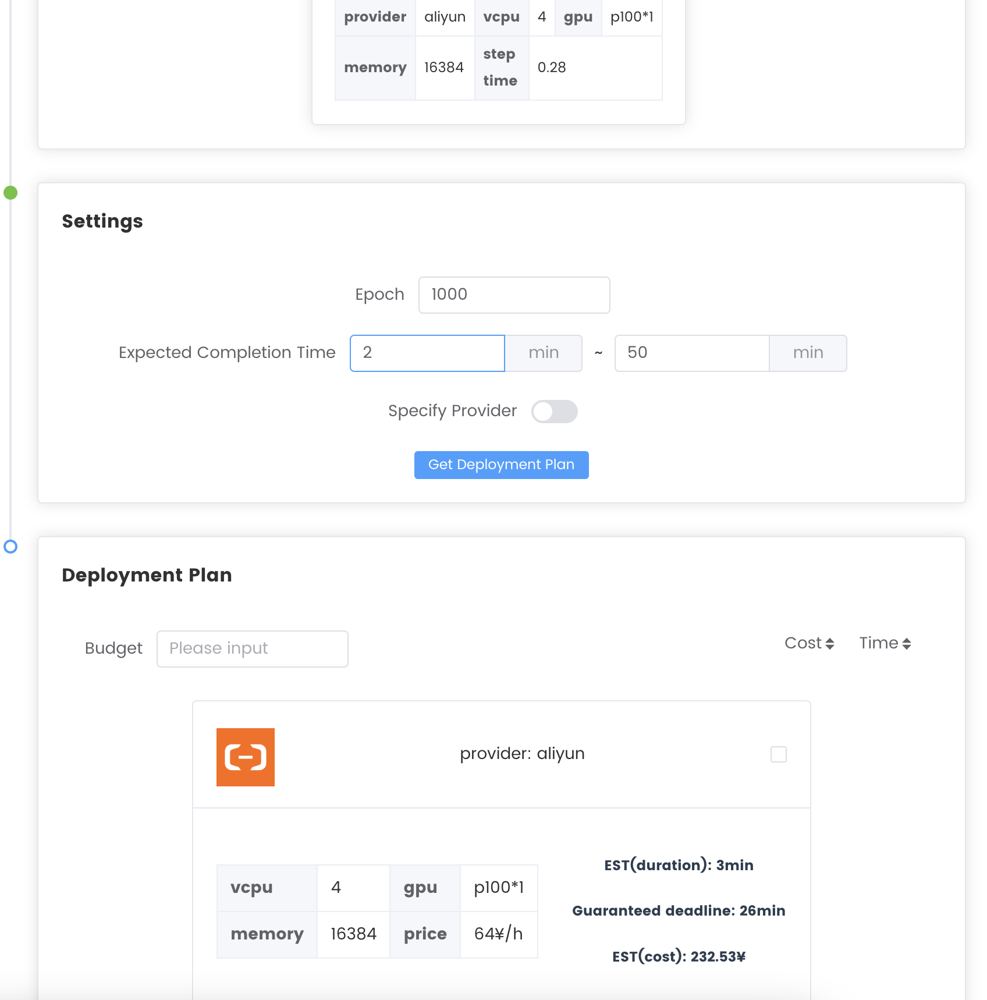

# ServerlessPilot

[TOC]

## ServerlessPilot 介绍

`ServerlessPilot`是基于服务器无感知计算的深度学习任务管理平台。它能够帮助开发者在各种实例上面部署深度学习任务，而开发者无需对下层的平台进行管理，`ServerlessPilot`使得开发者能够更加专注于深度学习任务的开发，减轻了开发者学习服务器管理的负担。

同时`ServerlessPilot`实现了对多种云服务的支持，并且向用户屏蔽了底层的细节。`ServerlessPilot`能够对深度学习任务进行自动解析，预估深度学习任务的时间，从而为用户提供多种部署方案，包括花费最少、运行最快等。

## 如何使用 ServerlessPilot

ServerlessPilot目前支持两类作业

- Naive Job
- ElasticFlow Job

ServerlessPilot的使用主要包含四部分

- 训练代码开发
  - [Naive Job训练代码开发](https://github.com/wecloudless/wecloud-cli-py/#naive-job训练代码开发)
  - [ElasticFlow Job训练代码开发](https://github.com/wecloudless/wecloud-cli-py/#elasticflow-job训练代码开发)
- [使用命令行工具上传任务](https://github.com/wecloudless/wecloud-cli-py/#使用命令行工具上传)
- [在网页端部署任务](https://github.com/wecloudless/wecloud-cli-py/#使用命令行工具上传)
- [在网页端监控任务](https://github.com/wecloudless/wecloud-cli-py/#使用命令行工具上传)

### Naive Job训练代码开发

#### 环境要求

`ServerlessPilot`提供较为灵活的执行环境，依赖需写入`<your_job>/requirements.txt`。
```
python=3.7
pytorch=1.13 (对应镜像wangqipeng/wecloud_train:v0.3.0)
```
用户也可以使用Docker Hub上已有的docker image，或将配置好环境的自定义的docker image打包上传至Docker Hub，然后编辑`.spilot.yaml`文件，使用自定义的docker image:
```
image: <user>/<repo>:<tag>
```
#### 使用要求
用户需使用`torch.distributed`实现分布式训练代码，初始化方式如下：
```PyThon
local_rank = int(os.environ["LOCAL_RANK"])
rank = local_rank
torch.cuda.set_device(local_rank)
dist.init_process_group(backend="nccl")
device = torch.device("cuda:{}".format(rank))
```

并在代码目录中放置`.spilot.yaml`文件即可（[样例](https://github.com/qipengwang/wecloud_train/blob/distributed/.spilot.yaml)），需要包含：
```
image: # 使用的镜像信息
setup: # 配置镜像外环境的指令
run: # 执行任务的指令
```
**⚠️注意⚠️**：本平台使用[torchrun](https://pytorch.org/docs/stable/elastic/run.html)指令启动任务。除模型、数据集可能需要指定分布式外，其他代码与单卡训练无异，不需要使用例如`torch.multiprocessing.spawn`等实现分布式的功能。


### ElasticFlow Job训练代码开发

#### 环境要求
`ServerlessPilot`提供较为灵活的执行环境。除python和pytorch版本限制外，其他依赖可自行指定，其他依赖需写入`<your_job>/requirements.txt`。
```
python=3.7
pytorch=1.13 (对应镜像wangqipeng/wecloud_train:v0.3.0)
```

#### 分布式支持
用户需使用`torch.distributed`实现分布式训练代码，初始化方式如下：
```PyThon
import torch.distributed as dist

local_rank = int(os.environ["LOCAL_RANK"])
rank = local_rank
torch.cuda.set_device(local_rank)
dist.init_process_group(backend="nccl")
device = torch.device("cuda:{}".format(rank))
```
**⚠️注意⚠️**：为避免分布式训练任务重复下载数据集，请在.spilot.yaml/setup中执行下载数据集的脚本，并在代码中使用下载好的本地数据集。

#### 训练超参数
为了支持任务profiling，训练代码的batch size和epoch需要按照指定的格式定义，具体代码如下：
```Python
import argparse

parser = argparse.ArgumentParser()
parser.add_argument('-b', type=int, default=128, help='batch size for dataloader')
parser.add_argument('--epoch', type=int, default=100, help='num of epochs to train')
```

<!-- #### 任务日志
为了支持任务profiling和提供必要的调度信息，训练代码需要包含一定格式的任务日志。开发者需要在每次迭代结束处输出下述格式的日志信息，以使用python logging库为例：
```Python
  # in the end of one iteration
  logging.info("epoch = {epoch}, iteration = {iteration}, trained_samples = {trained_samples}, total_samples = {total_samples}, loss = {loss}, lr = {lr}, current_epoch_wall-clock_time = {current_epoch_time}")
  if args.profiling:
      logging.info(f"PROFILING: dataset total number {len(dataloader.dataset)}, training one batch costs {one_batch_time} seconds")
      return
```
较高打印日志的频率可以提高profiling和调度的精确度，较低打印日志的频率可以降低日志量，开发者可自行决定日志的打印频率。 -->

#### 任务日志
为了支持任务profiling以提供必要的调度信息，训练代码需要提供相关任务日志。只需在用户代码中使用[W&B](https://wandb.ai/site)即可。所有执行环境会默认安装W&B，无需用户指定安装。需修改的代码如下：
```Python
# 程序开始处
import wandb
wandb.login(
  key="local-0b4dd77e45ad93ff68db22067d0d0f3ef9323636", 
  host="http://115.27.161.208:8081/"
)
run = wandb.init(
    project="<your_project_name>",
    entity="adminadmin",
    config={
        # any configs you need in the following way
        "learning_rate": args.lr,
        "epochs": args.epoch,
        "batch_size": args.b,
        "network": args.net
    }
)

# 每轮迭代处更新下述信息，至少应包含列出的项
wandb.log({
    "iteration": n_iter, # 从训练开始到现在的总迭代轮数
    "trained_samples": batch_index * args.b + len(images), # 在当前epoch中，已使用的数据个数
    "total_samples": len(cifar100_training_loader.dataset) # 数据集中总数据个数
})
```
**⚠️注意⚠️**：`wandb.log`中至少应包含上述列出的信息。

#### 弹性训练
为了支持弹性训练和间断训练，训练代码需要支持断点。开发者需要将每个epoch的模型参数存储在开发者指定的固定位置，并将文件名命名为指定的格式。

开始训练之前需要先保证该指定路径存在：
```Python
checkpoint_path = '/app/output/checkpoint'
#prepare folder
cmd = 'mkdir -p ' + checkpoint_path
#python 2.7 & 3
ret = subprocess.check_output(cmd, shell=True)
```
然后从这个开发者指定的路径读取最新的模型权重以及训练进度信息：
```Python
def most_recent_weights(weights_folder):
    """
        return most recent created weights file
        if folder is empty return empty string
    """
    weight_files = os.listdir(weights_folder)
    if len(weight_files) == 0:
        return ''

    regex_str = r'([0-9]+)'

    # sort files by epoch
    weight_files = sorted(weight_files, key=lambda w: int(re.search(regex_str, w).groups()[0]))

    return weight_files[-1]

def last_epoch(weights_folder):
    weight_file = most_recent_weights(weights_folder)
    if not weight_file:
       raise Exception('no recent weights were found')
    resume_epoch = int(weight_file)

    return resume_epoch


resume_epoch = last_epoch(checkpoint_path)
checkpoint_dir = os.path.join(checkpoint_path, '{epoch}')
```
训练时需从上一次保存权重的进度继续训练：
```Python
for epoch in range(1, args.epoch + 1):
    if epoch <= resume_epoch:
        continue
```
checkpoint文件需要保存在指定的位置：
```Python
torch.save(net.state_dict(), checkpoint_dir)
```

### 使用命令行工具上传

#### 命令行工具的安装

命令行工具基于`python=3.10`运行，需要安装下列包

- python 3.10
- pip-packages
  - requests
  - click
  - pyyaml

#### 命令行工具的使用

- 命令行运行方式

  ```shell
  python main.py                              
  Usage: python main.py [OPTIONS] COMMAND [ARGS]...
  
  Options:
    --config TEXT  # 使用的部署文件
    --help         # 显示帮助
  
  Commands:
    deploy  # 将模型部署到 Serverless Pilot
    login   # 登录到 Serverless Pilot
  ```

- 部署

  ```shell
  python main.py deploy --path <workspace relative path> --job <job name>
  ```

  该命令将任务部署到`ServerlessPilot`，若用户未登录，则需要输入用户名和密码

  **⚠️注意⚠️**：用户需要在工作目录下面创建`.spilot.yaml`文件用于指定任务运行的环境和命令，该文件最少包含运行所需要的命令，默认环境配置命令为`pip install -r requirements.txt`，下面展示了`.spilot.yaml`的示例

  **⚠️注意⚠️**：关于数据，请同样放在`<workspace relative path>`文件夹内。（目前会把数据一起打包进image，后续会支持将数据上传到nfs以减小image大小）

  **⚠️注意⚠️**：job name中不能带有下划线“_”，否则后续k8s会报错！

  ```yaml
  run: 
    python -u train.py --net googlenet --gpu
  ```

  若工作目录下面不包含`.spilot.yaml`文件，则该命令会提示用户输入运行命令

- 登陆

  ```shell
  python main.py login
  ```

  该命令要求用户登陆`ServerlessPilot`，需要输入用户名和密码

#### 示例

- 假设任务代码文件定义在上层目录, 比如 `../image-classification/`.

- 假设`.spilot.yaml`文件定义如下 ，其中 `run` 是必须的，否则用户需要在命令行输入运行命令

  ```yaml
  run: 
    python -u train.py --net googlenet --gpu
  ```

- 运行部署命令之后，该命令会将任务打包上传到`ServerlessPilot`，`ServerlessPilot`会拉取镜像，创建容器，配置环境并运行任务。

- 在任务运行开始之后，命令行工具会启动浏览器，打开网页端控制台，之后用户可以在网页端查看任务解析过程并部署任务。

### 在网页端部署

在网页端部署任务主要包含两步，首先`ServerlessPilot`运行任务并自动解析，预估任务每轮的运行时间，然后给出推荐的部署方案。用户选择一个方案部署任务

#### 任务类型选择与解析
命令行工具部署完毕之后会转到`ServerlessPilot`的训练任务的控制面板，该面板中用户可以点击`Select Task`然后选择任务，之后可以选择使用推荐配置部署naive job，或者选择部署ElasticFlow job。任务按照ID的字典序排列。


如果选择部署naive job，ServerlessPilot会直接按照所选择的配置部署任务。

如果选择部署ElasticFlow job，ServerlessPilot会对任务进行解析。


#### ElasticFlow Job的解析与部署
任务解析主要工作是预测当前任务在特定的配置下的运行时长。以深度学习训练为例，`ServerlessPilot`根据用户使用的数据集，预设的`batch_size`等参数，在不同的配置下运行训练任务，并以此预估训练任务每轮迭代花费的时间和成本。

任务解析完成之后，解析的结果会显示在当前页面。ServerlessPilot会自动估计每轮训练的时间并给出部署方案的建议，部署方案包含了任务部署的推荐配置以及预估的时间、预估的花费和推荐的提供商。配置方案包含多种，用户可以根据任务完成时间和花费进行选择，然后使用该方案部署即可。



### 在网页端监控

#### 在任务面板（Jobs panel）监控 

您可以通过侧边栏的`Jobs`进入任务面板，该面板会列出所有任务。您可以通过删除（`Delete`）删除任务


您可以通过点击任务名查看任务详情。任务的详情会显示在关于（`About`）界面.  任务详情包括任务部署的配置信息、任务的创建时间、任务运行时长等。您也可以在该页面删除任务


您也可以在日志（`log`）页面查看任务的输出


#### 在训练任务（Training jobs）面板监控

您可以通过下拉菜单进入训练任务（`Training jobs`）面板


您可以通过点击`info`获取任务的详情，之后会重定向到任务信息页面。


`ServerlessPilot`集成了`Tensorboard`. 你可以通过点击`Tensorboard`进入`Tensorboard`可视化页面

`VSCode` 和 `Jupyter Notebook` 正在研发中，敬请期待

#### 下载任务输出

在上传任务代码时，请将所有需要输出的文件（例如训练得到的模型检查点）输出到目录`/app/output/checkpoint/{epoch}`内（绝对路径, epoch为当前训练到第几个epoch，从1开始）。

#### 在总体（Overall）面板监控

该页面会显示资源的使用情况和任务列表。您也可以通过该页面获取任务的详情


## Profiling机制
ElasticFlow job的执行需要Serverless Pilot平台在job被部署前预先执行作业，并对作业的step time进行profile。Serverless Pilot平台在作业预执行时依赖[wandb](https://wandb.ai)监控作业进程，后端通过wandb提供的API读取记录到的相应field，并用其来预估作业在不同资源配置方案下的完成时间。

## 示例

我们提供了一个端到端的示例，以展示`ServerlessPilot`的运行工作流程。您可以[点击这里](https://disk.pku.edu.cn:443/link/CC7619B71190026088E7B1D8FC206C55)查看示例。

## 问题反馈
如果在使用CLI的时候遇到问题，请按照[该样例](https://github.com/wecloudless/wecloud-cli-py/issues/1)提交issue进行反馈。
