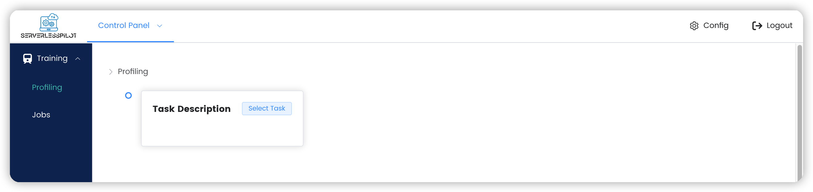
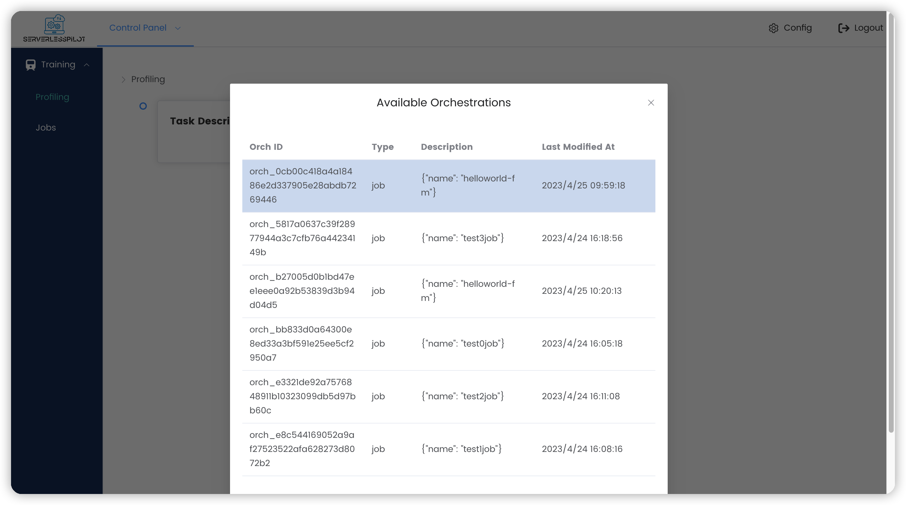
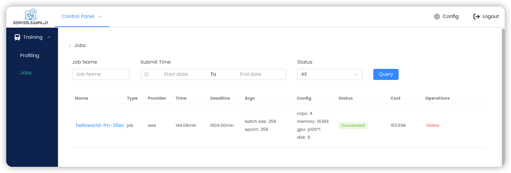
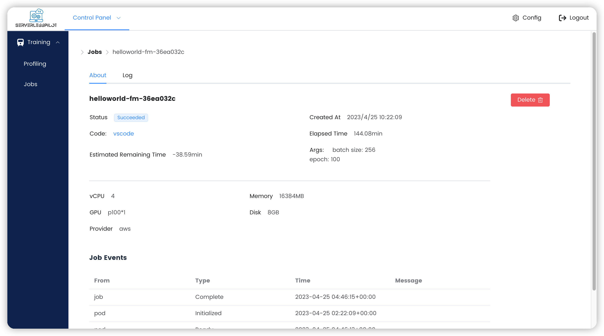
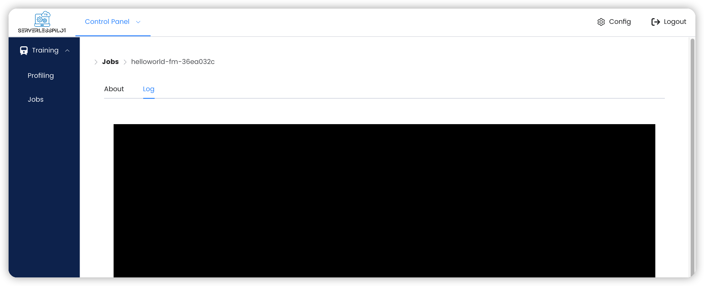
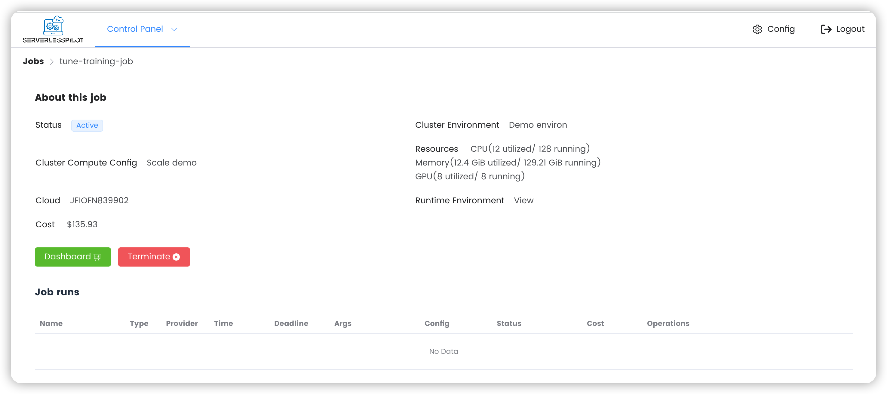
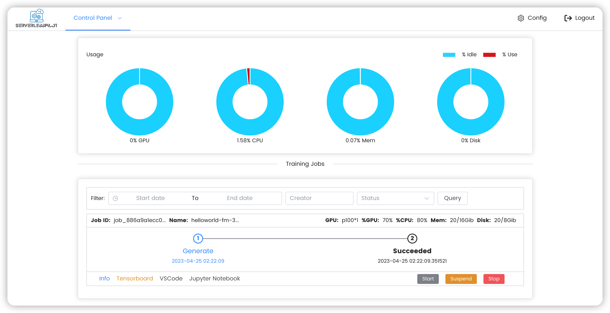

# ServerlessPilot

[TOC]

## ServerlessPilot 介绍

`ServerlessPilot`是基于服务器无感知计算的深度学习任务管理平台。它能够帮助开发者在各种实例上面部署深度学习任务，而开发者无需对下层的平台进行管理，`ServerlessPilot`使得开发者能够更加专注于深度学习任务的开发，减轻了开发者学习服务器管理的负担。

同时`ServerlessPilot`实现了对多种云服务的支持，并且向用户屏蔽了底层的细节。`ServerlessPilot`能够对深度学习任务进行自动解析，预估深度学习任务的时间，从而为用户提供多种部署方案，包括花费最少、运行最快等。

## 如何使用 ServerlessPilot

ServerlessPilot目前支持两类作业

- Naive Job
- ElasticFlow Job

本文档主要介绍如何在ServerlessPilot部署naive jobs。

ServerlessPilot的使用主要包含四部分

- 训练代码开发
- 使用命令行工具上传任务
- 在网页端部署任务
- 在网页端监控任务

### Naive Job训练代码开发

#### 环境要求


`ServerlessPilot`提供较为灵活的执行环境，依赖需写入`<your_job>/requirements.txt`。
```
python=3.7
pytorch=1.9 or 1.12
```
用户也可以使用Docker Hub上已有的docker image，或将配置好环境的自定义的docker image打包上传至Docker Hub，然后编辑`.spilot.yaml`文件，使用自定义的docker image:
```
image: <user>/<repo>:<tag>
```

### 使用命令行工具上传

#### 命令行工具的安装

命令行工具基于`python=3.10`运行，需要安装下列包

- python 3.10
- pip-packages
  - requests
  - click
  - pyyaml

#### 命令行工具的使用

- 命令行运行方式

  ```shell
  python main.py                              
  Usage: python main.py [OPTIONS] COMMAND [ARGS]...
  
  Options:
    --config TEXT  # 使用的部署文件
    --help         # 显示帮助
  
  Commands:
    deploy  # 将模型部署到 Serverless Pilot
    login   # 登录到 Serverless Pilot
  ```

- 部署

  ```shell
  python main.py deploy --path <workspace relative path> --job <job name>
  ```

  该命令将任务部署到`ServerlessPilot`，若用户未登录，则需要输入用户名和密码

  **⚠️注意⚠️**：用户需要在工作目录下面创建`.spilot.yaml`文件用于指定任务运行的环境和命令，该文件最少包含运行所需要的命令，默认环境配置命令为`pip install -r requirements.txt`，下面展示了`.spilot.yaml`的示例

  **⚠️注意⚠️**：关于数据，请同样放在`<workspace relative path>`文件夹内。（目前会把数据一起打包进image，后续会支持将数据上传到nfs以减小image大小）

  **⚠️注意⚠️**：job name中不能带有下划线“_”，否则后续k8s会报错！

  ```yaml
  run: 
    python -u train.py --net googlenet --gpu
  ```

  若工作目录下面不包含`.spilot.yaml`文件，则该命令会提示用户输入运行命令

- 登陆

  ```shell
  python main.py login
  ```

  该命令要求用户登陆`ServerlessPilot`，需要输入用户名和密码

#### 示例

- 假设任务代码文件定义在上层目录, 比如 `../image-classification/`.

- 假设`.spilot.yaml`文件定义如下 ，其中 `run` 是必须的，否则用户需要在命令行输入运行命令

  ```yaml
  run: 
    python -u train.py --net googlenet --gpu
  ```

- 运行部署命令之后，该命令会将任务打包上传到`ServerlessPilot`，`ServerlessPilot`会拉取镜像，创建容器，配置环境并运行任务。

- 在任务运行开始之后，命令行工具会启动浏览器，打开网页端控制台，之后用户可以在网页端查看任务解析过程并部署任务。

### 在网页端部署

在网页端部署任务主要包含两步，首先`ServerlessPilot`运行任务并自动解析，预估任务每轮的运行时间，然后给出推荐的部署方案。用户选择一个方案部署任务

#### 任务类型选择
命令行工具部署完毕之后会转到`ServerlessPilot`的训练任务的控制面板，该面板中用户可以点击`Select Task`然后选择任务，之后可以选择使用推荐配置部署naive job。任务按照ID的字典序排列。







选择部署naive job，ServerlessPilot会直接按照所选择的配置部署任务。

### 在网页端监控

#### 在任务面板（Jobs panel）监控 

您可以通过侧边栏的`Jobs`进入任务面板，该面板会列出所有任务。您可以通过删除（`Delete`）删除任务



您可以通过点击任务名查看任务详情。任务的详情会显示在关于（`About`）界面.  任务详情包括任务部署的配置信息、任务的创建时间、任务运行时长等。您也可以在该页面删除任务



您也可以在日志（`log`）页面查看任务的输出



#### 在训练任务（Training jobs）面板监控

您可以通过下拉菜单进入训练任务（`Training jobs`）面板


您可以通过点击`info`获取任务的详情，之后会重定向到任务信息页面。



`ServerlessPilot`集成了`Tensorboard`. 你可以通过点击`Tensorboard`进入`Tensorboard`可视化页面

`VSCode` 和 `Jupyter Notebook` 正在研发中，敬请期待

#### 下载任务输出

在上传任务代码时，请将所有需要输出的文件（例如训练得到的模型检查点）输出到目录`./output`内（**必须使用相对于本地项目文件夹的相对路径，不能使用绝对路径**）。例如，本地项目路径是`~/training-job/`，则应输出到`~/training-job/output`内，由于要使用相对`~/training-job/`的相对路径，因此项目内输出路径应设置为`./output`。

**这里推荐大家直接使用`./output`作为输出文件夹。**

#### 在总体（Overall）面板监控

该页面会显示资源的使用情况和任务列表。您也可以通过该页面获取任务的详情




## 示例

我们提供了一个端到端的示例，以展示`ServerlessPilot`的运行工作流程。您可以[点击这里](https://disk.pku.edu.cn:443/link/CC7619B71190026088E7B1D8FC206C55)查看示例。

## 问题反馈
如果在使用CLI的时候遇到问题，请按照[该样例](https://github.com/wecloudless/wecloud-cli-py/issues/1)提交issue进行反馈。
