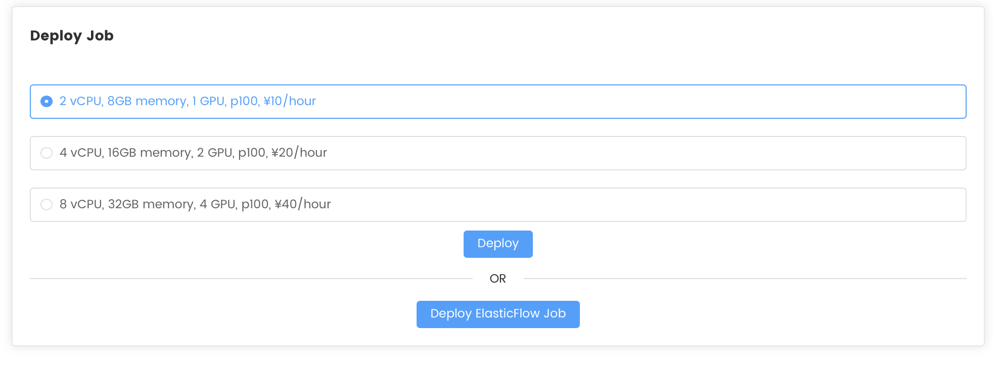
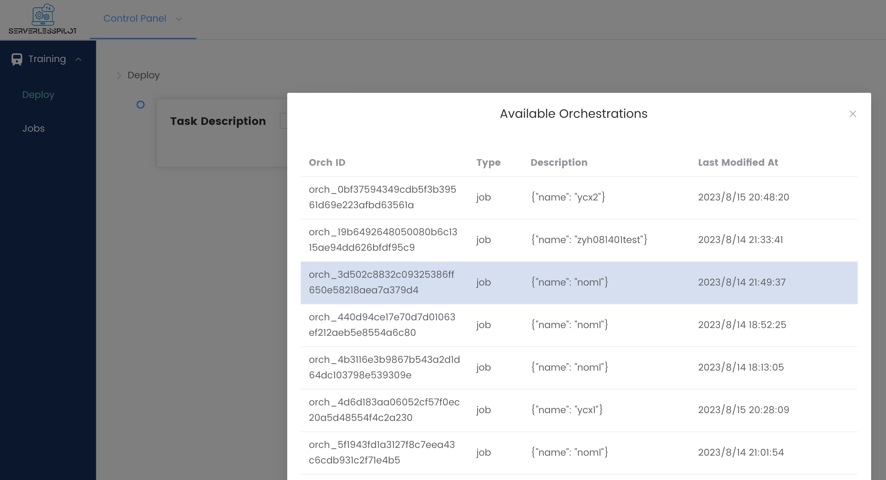
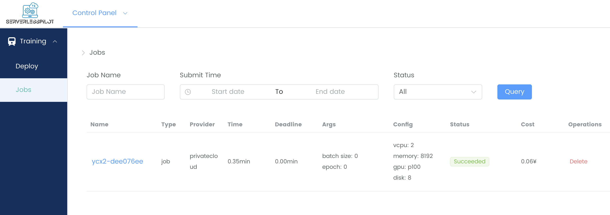
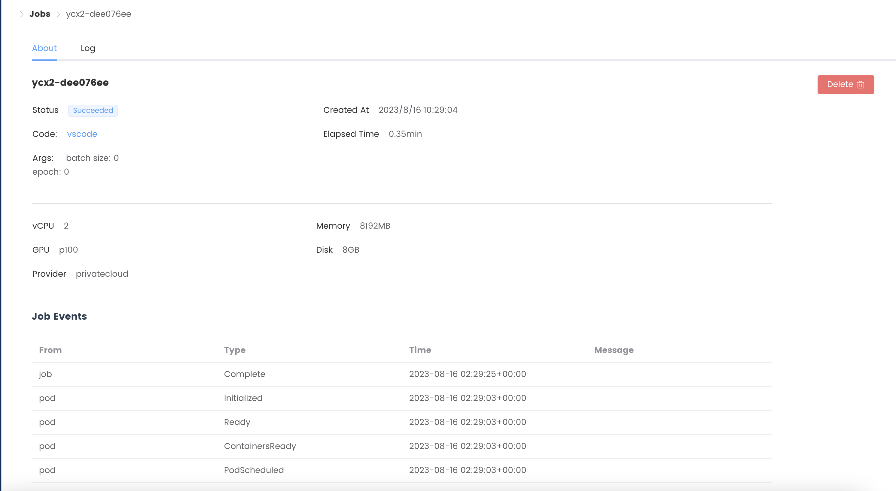
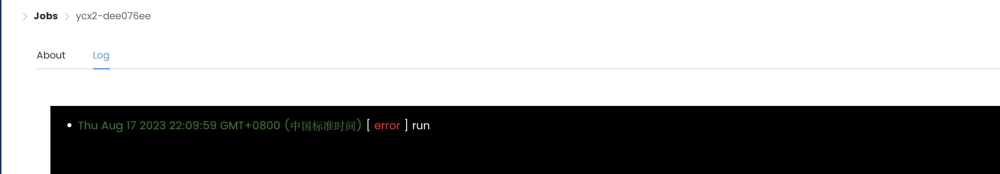

# 如何使用 ServerlessPilot部署Naive Job

ServerlessPilot的使用主要包含四部分

ServerlessPilot的使用主要包含四部分：
- 任务代码开发
- 使用命令行工具上传任务
- 部署任务
- 监控任务

## 1. 任务代码开发

用户可自由开发代码，仅需在任务目录`<your_job>`下额外添加`.spilot.yaml`文件，下面展示了`.spilot.yaml`的示例。

```yaml
image: wangqipeng/wecloud_train:v0.2.0 # your own image 

# setup commands before running your job
setup: |
  uname -a
  echo "hello world"
  python3 --version
  pip3 install -r requirements.txt

# commands to run your job
run: |
  python
  -u
  train.py
  --net
  googlenet
  --gpu
```

该文件指定了任务的以下属性：

1. 基础运行环境 `image` - 可缺省，缺省时使用平台提供的默认镜像，包含`python 3.7`和`pytorch 1.9`环境。

2. 环境配置指令 `setup` - 用于配制环境（例如安装任务的依赖，设置环境变量等）。可缺省，缺省时默认执行`pip install -r requirements.txt`操作。

3. 任务运行指令 `run` - 运行任务所执行的命令，不可省略。

我们提供了一个[示例项目](https://github.com/wecloudless/wecloud_example)供参考。

  **⚠️注意⚠️**：为保障任务上传效率，任务代码大小限制为100MB，请将数据集、模型参数等较大的文件上传到在线平台（如Google Drive等），并在任务里添加获取在线文件的代码。

  **⚠️注意⚠️**：请在代码中使用相对路径访问和保存子模块、数据集和模型参数等。

## 2. 使用命令行工具上传

### 安装命令行工具

```shell
git clone https://github.com/wecloudless/wecloud-cli-py.git
cd wecloud-cli-py
pip install pipenv
pipenv shell
```

### 使用命令行工具登陆

```shell
python main.py login
... # input your username and password
```

### 使用命令行工具登陆

```shell
python main.py deploy --path <path_to_your_job> --job <job name>
```

**⚠️注意⚠️**：job name中不能带有下划线“_”，否则后续k8s会报错！


## 3. 部署任务

命令行工具将任务上传完毕后，会在浏览器中自动打开`ServerlessPilot`的任务控制面板，显示刚上传的任务和多个推荐部署方案。选择一个部署方案并点击`Deploy`按钮即可部署。


如需选择其他任务，可以在该面板中点击`Select Task`并选择其他任务。




## 4. 监控任务 

您可以通过侧边栏的`Jobs`进入任务面板，该面板会列出所有任务。您可以通过删除（`Delete`）删除任务。



您可以通过点击任务名查看任务详情。任务的详情会显示在关于（`About`）界面.  任务详情包括任务部署的配置信息、任务的创建时间、任务运行时长等。您也可以在该页面删除任务。



您也可以在日志（`Log`）页面查看任务的输出。



下载任务输出：在上传任务代码时，请将所有需要输出的文件（例如训练得到的模型检查点）输出到目录`<your_job>/output`内。
**代码中必须使用相对路径`./output`， 不能使用绝对路径**。


## Demo

我们提供了使用`ServerlessPilot`平台的完整演示视频，以展示本平台的工作流程。您可以[点击这里](https://disk.pku.edu.cn:443/link/CC7619B71190026088E7B1D8FC206C55)查看示例。

